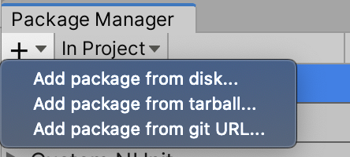

# Installation via UPM

Unity Package Manager, or UPM for short, is Unity's new solution for managing packages so they don't need to be included inside the /Assets folder.

Like many other similar systems (such as NPM, NuGet, Maven), you only reference the package name (and optionally from which registry to find it). The benefit of this is that you can safely push your list of package references to your version control system of choice (git, mercury, TFS), without having to push the entire list of binaries. Saving a lot of duplicated binaries and annoying updating procedures in the process.

Have a look at the Unity [Package Manager docs](https://docs.unity3d.com/Packages/com.unity.package-manager-ui@2.1/manual/index.html) for more info.

>Note: Requires Unity Editor 2018.1 or above, as UPM was first shipped with 2018.1.

This extension can be installed using Unity package manager.



- from git URL
```
https://github.com/vlad3489/condition-reaction-system.git
```
- or manually, clone repo
	- Select `Add package from disk...` and select folder

	- Or open <project>/Packages/manifest.json, then add the package in the list of dependencies and add [path (absolute or relative)](https://docs.unity3d.com/Manual/upm-localpath.html)


